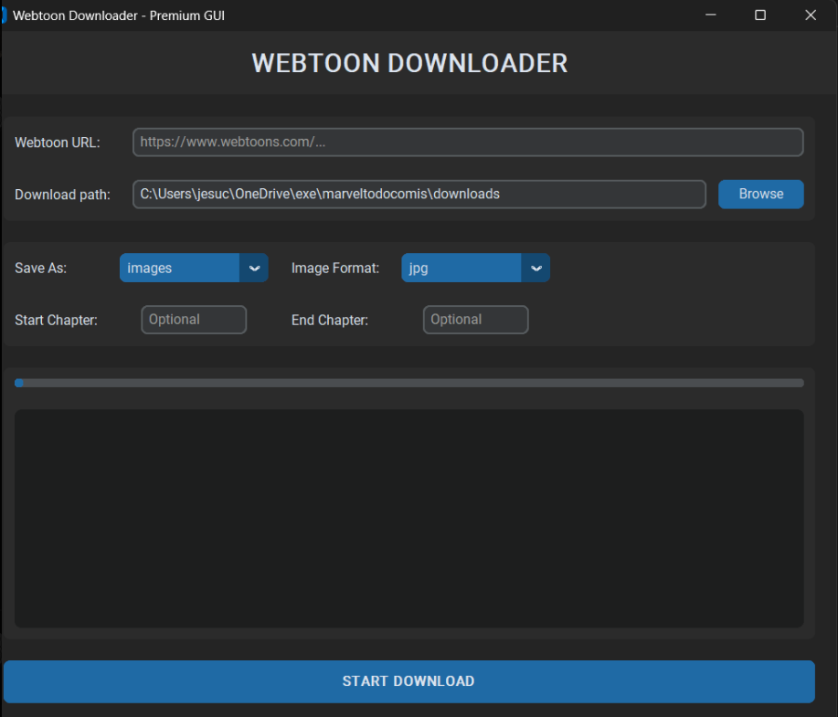

<br />
<p align="center">
  <h2 align="center">Webtoon Downloader</h2>
  <p align="center">
    A fast and premium GUI & CLI for downloading chapters from Webtoons. ⚡📚
    <br />
    <br />
    <a href="https://github.com/Zehina/Webtoon-Downloader/issues">Report Bug</a>
    ·
    <a href="https://github.com/Zehina/Webtoon-Downloader/issues">Request Feature</a>
    ·
    <a href="https://zehina.github.io/Webtoon-Downloader/">View Docs</a>
  </p>
</p>

[](https://github.com/Zehina/Webtoon-Downloader/releases)
[](https://github.com/Zehina/webtoon-downloader/actions/workflows/main.yml?query=branch%3Amaster)
[](https://img.shields.io/github/commit-activity/m/Zehina/webtoon-downloader)
[](https://img.shields.io/github/license/Zehina/webtoon-downloader)

<p align="center">
  
</p>

## Language | Idioma
**🇬🇧 English** | [🇪🇸 Español](README.es.md)

## What It Does 🌐

Webtoon Downloader downloads public Webtoons series and saves them as:

- image folders
- ZIP archives
- CBZ archives
- PDFs

It also supports metadata export, image quality selection, retry strategies, proxies, and async downloads with progress reporting.

Supported site:

- [https://www.webtoons.com/](https://www.webtoons.com/)

## Usage 🚀

### ✨ Premium GUI
The easiest way to use Webtoon Downloader is through the new graphical interface. It provides a user-friendly way to configure downloads and track progress.

**To run the GUI:**
1. Ensure you have the requirements installed:
   ```bash
   pip install -r requirements.txt  # Or use 'uv sync'
   ```
2. Launch the application:
   ```bash
   python gui.py
   ```

### 💻 Fast CLI
For power users, the command-line interface offers speed and scriptability.

**Install CLI:**
```bash
uv tool install webtoon_downloader
# OR
pipx install webtoon_downloader
```

**Download a series:**

```bash
webtoon-downloader "https://www.webtoons.com/en/.../list?title_no=..."
```

Useful first commands:

```bash
webtoon-downloader [url] --latest
webtoon-downloader [url] --start 10 --end 25
webtoon-downloader [url] --save-as cbz
webtoon-downloader [url] --out ./downloads --separate
webtoon-downloader [url] --export-metadata --export-format json
webtoon-downloader [url] --proxy http://127.0.0.1:7890 --concurrent-pages 5
webtoon-downloader [url] --debug
```

Run `webtoon-downloader --help` for generated CLI help.

## Documentation 📚

Full docs site:

- [Documentation Home](https://zehina.github.io/Webtoon-Downloader/)

Useful pages:

- [Getting Started](https://zehina.github.io/Webtoon-Downloader/getting-started/)
- [CLI Guide](https://zehina.github.io/Webtoon-Downloader/cli/)
- [FAQ](https://zehina.github.io/Webtoon-Downloader/faq/)
- [Architecture](https://zehina.github.io/Webtoon-Downloader/architecture/)
- [Development](https://zehina.github.io/Webtoon-Downloader/development/)
- [API Reference](https://zehina.github.io/Webtoon-Downloader/modules/)

Repository copies of those docs:

- [docs/getting-started.md](docs/getting-started.md)
- [docs/cli.md](docs/cli.md)
- [docs/faq.md](docs/faq.md)
- [docs/architecture.md](docs/architecture.md)
- [docs/development.md](docs/development.md)
- [docs/modules.md](docs/modules.md)

## Known Limitations ⚠️

Some failures are outside the project’s control:

- Webtoons rate limiting and slow CDN responses
- Daily Pass and app-only chapter access
- upstream site markup or API changes

If you want details and workarounds, read the [FAQ](docs/faq.md).

## Contributing 🤝

Contributions are welcome.

Typical flow:

1. Fork the repo
2. Create a branch
3. Make your changes
4. Run checks
5. Open a pull request

Contributor docs:

- [Development Guide](docs/development.md)

## Disclaimer ⚠️

This tool is intended for personal and educational use only. You are responsible for how you use it, including compliance with the terms of service of the websites involved.

## License 📄

Distributed under the MIT License. See [LICENSE](LICENSE).

## Contact 📬

**Zehina** – [zehinadev@gmail.com](mailto:zehinadev@gmail.com)

Project links:

- [Repository](https://github.com/Zehina/Webtoon-Downloader)
- [Issues](https://github.com/Zehina/Webtoon-Downloader/issues)
- [Docs Site](https://zehina.github.io/Webtoon-Downloader/)
